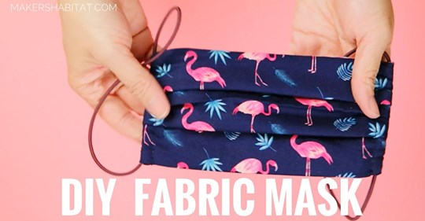

## Why Masks for Irvine?

COVID-19 is rapidly spreading through our nation and community. Just a month ago, it may have seemed that the virus was just a problem on the other side of the world, but now it is here and spreading quickly. In Irvine, we already have over 65 cases as of April 2nd. We must act now to do all we can to stop its growth and plan for a future where we can resume life without fear of another costly outbreak. Thus, we should begin to look at other effective methods of slowing the viral growth now and when we end the shelter in place policy. One promising method is to get everyone in Irvine to wear facial mask in public spaces. Masks for Irvine is an effort to get community involvement in creating masks for all Irvine residence and for getting everyone to wear one in public until COVID-19 is no longer a threat.

## How does wearing a mask help stop the spread of COVID-19?

|  | 
|:---:|:---:|
| With no mask, droplets spray upwards of [8 feet](http://math.mit.edu/~bush/wordpress/wp-content/uploads/2014/04/Sneezing-JFM.pdf). | Wearing a Mask, keeps the droplets relatively contained.  |

Wearing a mask serves two purposes. First, it can reduce and potentially block the viral load that you inhale around another sick individual and lower your odds of getting infected. If you do get infected, the smaller viral load can also reduce the [severity of the sickness](https://www.thelancet.com/journals/laninf/article/PIIS1473-3099(20)30232-2/fulltext). Second, wearing a mask can reduce the likelihood of you un-intentionally infecting others around you when you are asymptomatic. [A study in Iceland](https://www.government.is/news/article/2020/03/15/Large-scale-testing-of-general-population-in-Iceland-underway/) estimates that 50% of COVID-19 infected are asymptomatic. Because of the high amount of asymptomatic cases, it's prudent we take safety precautions even when we are not showing symptoms. So, wearing a mask will both better protect you and others around you from contracting COVID-19. 

## Do we even need a mask if we are all sheltering in place?

The reality is that even with the shelter in place policy, people are still leaving their homes for valid reasons. Some still need to go to their jobs in essential services such as grocery stores, banks, and pharmacies. Others still need to go out to buy groceries, medicines, and other essential goods. Of course, if you can stay at home, then you should stay at home. But, if you need to leave your home and go in public, you should wear a mask to help slow the spread of COVID-19. 

## Shouldn't we reserve all masks for healthcare workers?

Yes, we should send healthcare workers the masks they need. We should be sending them our N95 masks and surgical masks. We should give them these protective gear because they are ones most at danger of catching the disease. However, we can do more. We should be working on expanding the number of available masks in our community. If we can outfit each person with a mask and get them to wear it in public, we can reduce the rate of infection, which would help reduce the number of sick people that need to go to the hospital. While we should send the N95 and surgical masks to the hospitals, we should make and use DIY masks ourselves.

## Is wearing a homemade-mask effective?

Yes, homemade-masks are effective at blocking microparticles and does help with lowering the chance of spreading and catching COVID-19. Although not as effective as N95 masks, homemade-masks are much better than not wearing a mask at all. In a 2008 research paper, [Professional and Homemade Face Masks Reduce Exposure to Respiratory Infections among the General Population](https://www.ncbi.nlm.nih.gov/pmc/articles/PMC2440799/), published in the National Institute of Health, the researchers concluded that 

> ..any type of general mask use is likely to decrease viral exposure and infection risk on a population level, in spite of imperfect fit and imperfect adherence.s

Basically, we are much better off wearing a mask in public.

## How can I make one?

Here is a link to a YouTube video showing how to create your DIY fabric masks.

If you don't know how to sew or use a sewing machine, you can learn how in an afternoon. 

**DIY Covid-19 Fabric Mask (with Filter Pocket) Sewing Tutorial**

## What can we do to make it happen?

Let's follow the successful example of the Czech Republic. On March 18th, the Czech Republic passed a regulation requiring citizens to wear face masks in all workplaces. The nation of 10.6 million people, through community effort, got to 100% mask usage in 10 days, nearly through home DIY effort.  They were able to flatten the curve. On April 2nd their current rate of infection is only 4 persons / million people, and the U.S is already at 741 persons / million people.

So what can we do:

1. Start creating DIY masks for your family and friends.
2. Start creating DIY masks for other community members.
3. Wear a mask when you go in public. 
4. If you own a business, get masks for your employees and have them wear it.
5. Educate others on the benefits of wearing a mask.

## How much will it cost to outfit everyone in Irvine with a mask?

Irvine population:  280,000

### Materials

| Material        | Cost           | Amount  | Required for 1 Mask | Cost / Mask
| ------------- |:-------------:| -----:|-----:|-----:|
| [100 Yards of Elastic Band](https://www.amazon.com/Bingcute-1-0MM-White-Beading-Elastic/dp/B01LX50N4Y)     | $8.99 | 100 yd | 12 inches | $0.03
| [Sew Classic Solid Cotton Fabric](https://www.joann.com/sew-classic-solid-cotton-fabric/zprd_17020546a.html)      | $4.89    |   1 yd | 60 sq. inches (x3) | $0.67
| Total | | | | $0.70

The estimate above assumes you are creating a three-layered mask where each layer is 60 sq. inches. Accounting for waste and taxes, we estimate that a mask will cost $0.85. If we buy the materials at retail, then the materials will cost approximately :

`Retail Material Costs: $0.85 x 280,000 = $238,000`

However, if we can get our city leaders to be proactive and order this material on behalf of its citizens, we can get a wholesale price. Ordering wholesale can potentially drop the cost of materials by a third to a half. 

`Wholesale Material Costs: $120,000 - $160,000` 

After purchasing the materials, we will still need people in the community to assemble kits and sew the masks. One group of people can outline the pattern on the fabric, cut the fabric, and assemble mask kits to distribute. To create the kits it could take

`12 days to create 280,000 kits with the help of 1000 people each creating 24 kits per day.`

Then, those that are capable of sewing can start creating masks, outfitting themselves and their family with those masks, and sharing masks with their neighbors and others in the community. I'm not exactly sure the exact number of people who know how to sew in Irvine but let's assume there exists 1000 capable and willing people. 

`In 14 days, 1000 people each sewing 20 face masks per day can create 280,000 face masks.`

We can have enough masks for all of Irvine.

## What will this site do? 

We will start highlighting businesses in Irvine that adopt a policy to require all workers to wear a mask at work and highlight companies that take an even more proactive step who require customers to wear a mask at the place of business. I hope this site can help create social pressure to get our community to start wearing masks. 

| Store | Address | All Employees Wear Mask | Requires Customers to Wear masks
| ------------- |-----:|-----:|-----:|
| 99 Ranch |15333 Culver Dr, Ste 800, Irvine, CA | YES | NO
